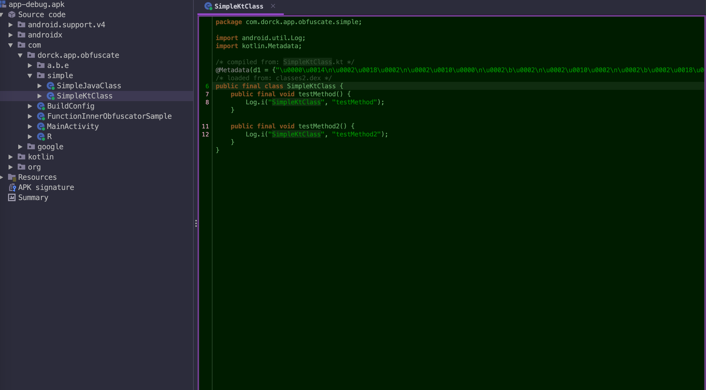

# app-code-obfuscation
| 中文  | [English](README_en.md) |
|-----|--------------|

[](https://search.maven.org/artifact/cn.dorck.android/code-guard-plugin)  [](https://plugins.gradle.org/plugin/cn.dorck.code.guarder)  [](https://opensource.org/licenses/Apache-2.0)

Android插入式代码混淆工具，基于ASM在编译期间植入无意义字节码，以提高逆向成本。

> *You can find the latest released plugin version on [Gradle Plugin Portal](https://plugins.gradle.org/plugin/cn.dorck.component.publisher).*

### 特性
- 支持插入类的成员变量、静态变量、方法及方法体内的代码段等
- 支持自定义随机代码字典，增强定制性
- 支持插入作用域控制（类级别、包级别和所有类）
- 支持变体范围约束（e.g, 只针对 `release` 包执行混淆）
- 支持 AGP 8.0 及其以下版本的功能适配
- 支持通用ASM插件的基础库下沉，降低后续插件开发成本

### 效果预览
> *更新于 2023/01/06*

此处以 sample 中的 [`SimpleKtClass.kt`](./app/src/main/java/com/dorck/app/obfuscate/simple/SimpleKtClass.kt) 文件为例，对比一下通过本项目插件处理前后的效果：

| 处理前                                                       | 处理后                                               |
| ------------------------------------------------------------ | ---------------------------------------------------- |
|  |  |


### 快速使用
> 目前稳定版本尚未发布，临时版本为：`0.1.2-beta`
#### 1. 引入插件
首先在 `app/build.gradle.kts` 或 `xx_library_module/build.gradle.kts` 中引入混淆插件：

```kotlin
plugins {
    id("com.android.application")
    // 引入增强版混淆插件
    id("cn.dorck.code.guarder") version "0.1.2-beta"
}
```
#### 2. 使用插件
然后在 `build.gradle.kts` 中配置插件相关特性：
```kotlin
codeGuard {
    // 开启插件
    enable = true
    // 设置插件执行的范围(若不设置则默认所有buildType都会执行)
    variantConstraints = hashSetOf("debug")
    // 需要混淆处理的目标代码包路径(用于局部代码混淆时使用，不设置则默认处理全局代码)
    processingPackages = hashSetOf(
        "com.dorck.app.obfuscate.simple"
    )
}
```
更多的特性参考后面的配置项一栏具体介绍。

#### 3. 关于插件自定义混淆字典
> 目前该功能尚在开发中，暂不开放，当前仅支持插件内部的默认随机混淆规则。

### 当前进展
- [X] 实现默认内置的类混淆基本功能
- [X] 实现方法内的随机代码混淆
- [x] 提供更加灵活的配置项（类、方法、代码块等混淆配置）
- [x] 混淆范围细化到函数级别
- [x] 将执行范围约束到某种变体（如 release）
- [x] 支持针对 `Library module` 的混淆操作
- [x] 支持针对多个随机类的方法调用
- [x] 针对随机方法调用提供多参数支持
- [x] 增加对随机方法调用参数默认值的随机化处理
- [ ] 多线程并行执行，优化混淆速度
- [ ] APK体积和编译时常影响分析
- [ ] 自定义混淆字典功能

### 配置项

| 可配置项                       | 说明                                       | 类型                |
|:---------------------------|------------------------------------------|-------------------|
| `maxMethodCount`           | 类中允许插入方法的数量上限（默认为 `8` ）                  | `int`             |
| `maxFieldCount`            | 类中允许插入变量的数量上限（默认为 `10` ）                 | `int`             |
| `minMethodCount`           | 类中允许插入方法的数量下限（默认为 `2` ）                  | `int`             |
| `minFieldCount`            | 类中允许插入变量的数量下限（默认为 `5` ）                  | `int`             |
| `isInsertCountAutoAdapted` | 是否根据当前类或方法的具体情况自动适配插入的方法或变量的数量           | `boolean`         |
| `processingPackages`       | 需要混淆处理的包路径（若未设置，则默认所有路径）                 | `HashSet<String>` |
| `isSkipJars`               | 是否跳过第三方 jar 的混淆增强（默认为 `true`）            | `boolean`         |
| `obfuscationDict`          | 自定义的混淆代码字典文件，可自行配置插入的代码和离散程度（格式参照下方详细介绍） | `String`          |
| `isSkipAbsClass`           | 是否跳过抽象类的混淆增强（默认为 `true`）                 | `boolean`         |
| `methodObfuscateEnable`    | 是否对方法进行混淆 （默认为 `true`）                   | `boolean`         |
| `maxCodeLineCount`         | 方法内允许插入的最大代码行数 （默认为 `6` ）                | `int`             |
| `generatedClassPkg`        | 生成方法内随机代码调用的目标类的包名（仅在开启方法内混淆时使用）         | `String`          |
| `generatedClassName`       | 生成方法内随机代码调用的目标类的类名（仅在开启方法内混淆时使用）         | `String`          |
| `generatedMethodCount`     | 生成方法内随机代码调用的目标类中方法数量（仅在开启方法内混淆时使用）       | `int`             |
| `genClassCount`            | 生成随机调用类的数量（可显著降低方法内插入代码的重复率）             | `int`             |
| `excludeRules`             | 混淆插件处理的排除规则（可理解为白名单，用于控制混淆范围）            | `HashSet<String>` |
| `variantConstraints`       | 设置插件执行的范围(若不设置则默认所有buildType都会执行)        | `HashSet<String>` |

### Todo & Bugfix
- [X] 偶现打开App后闪退，提示找不到生成的调用类（由于构建cache导致Task未执行）
- [ ] 随机调用类生成任务执行前支持使用上次执行产物或清空上次的产物
- [ ] 支持手动执行 Task 来清除生成的随机调用类
- [ ] 支持自动清除随机调用类(监听编译失败的时机)

### 维护计划
关于近期开发计划请参考 [目前进展专区](https://github.com/Moosphan/app-code-obfuscation?tab=readme-ov-file#%E5%BD%93%E5%89%8D%E8%BF%9B%E5%B1%95) 。目前笔者会在感兴趣的领域从事一些开源的项目，如果你对本项目有什么好的建议或者问题，欢迎移步 [Issue](https://github.com/Moosphan/app-code-obfuscation/issues) 说出的你的想法和问题，这将有助于该项目更加持续稳定的面向更多开发者使用。 

### License
```
   Copyright [2023] [Moosphan]

   Licensed under the Apache License, Version 2.0 (the "License");
   you may not use this file except in compliance with the License.
   You may obtain a copy of the License at

       http://www.apache.org/licenses/LICENSE-2.0

   Unless required by applicable law or agreed to in writing, software
   distributed under the License is distributed on an "AS IS" BASIS,
   WITHOUT WARRANTIES OR CONDITIONS OF ANY KIND, either express or implied.
   See the License for the specific language governing permissions and
   limitations under the License.
```