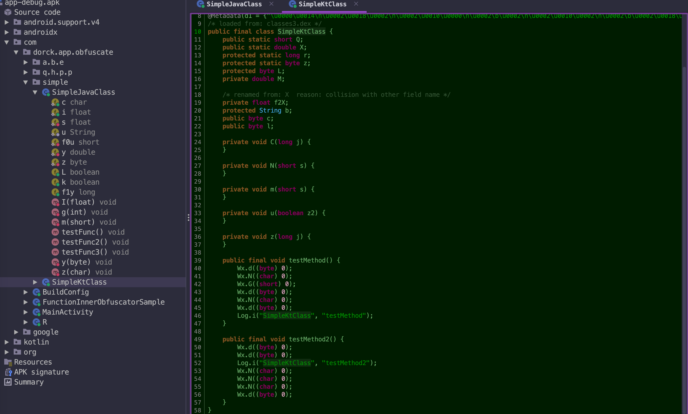

# app-code-obfuscation
Android plug-in code obfuscation tool, based on ASM, implants meaningless bytecode during compilation.
> Android插入式代码混淆工具，基于ASM在编译期间植入无意义字节码，以提高逆向成本。

### 特性
- 在Proguard优化class字节码之后执行，从而避免被混淆工具优化
- 支持插入类的成员变量、静态变量、方法及方法体内的代码段等
- 支持自定义随机代码字典，增强定制性
- 支持插入作用域控制（类级别、包级别和所有类）
- 支持变体范围约束（e.g, 只针对 `release` 包执行混淆）
- 支持 AGP 8.0 及其以下版本的功能适配
- 支持通用ASM插件的基础库下沉，降低后续插件开发成本

### 效果预览

此处以 sample 中的 [`SimpleKtClass.kt`](./app/src/main/java/com/dorck/app/obfuscate/simple/SimpleKtClass.kt) 文件为例，对比一下通过本项目插件处理前后的效果：

| 处理前                                                       | 处理后                                               |
| ------------------------------------------------------------ | ---------------------------------------------------- |
|  |  |


### 快速使用
> 目前稳定版本尚未发布，临时版本为：`0.0.1-SNAPSHOT`
#### 1. 引入插件
```kotlin
pluginManagement {
    repositories {
        google()
        mavenCentral()
        gradlePluginPortal()
        // 依赖SNAPSHOT仓库源
        maven(uri("https://s01.oss.sonatype.org/content/repositories/snapshots/"))
        mavenLocal()
    }

    resolutionStrategy {
        // 目前临时版本暂时通过此方式引入插件声明，后续发布到gradlePluginPortal再替换
        eachPlugin {
            if (requested.id.id == "cn.dorck.code.guarder") {
                useModule("cn.dorck.android:code-guard-plugin:0.0.1-SNAPSHOT")
            }
        }
    }
}
dependencyResolutionManagement {
    repositoriesMode.set(RepositoriesMode.PREFER_SETTINGS)
    repositories {
        google()
        mavenCentral()
        // 依赖SNAPSHOT仓库源
        maven(uri("https://s01.oss.sonatype.org/content/repositories/snapshots/"))
        mavenLocal()
    }
}
```
#### 2. 使用插件
首先在 `app/build.gradle.kts` 中引入混淆插件：
```kotlin
plugins {
    id("com.android.application")
    // 引入增强版混淆插件
    id("cn.dorck.code.guarder")
}
```
然后配置插件相关特性：
```kotlin
codeGuard {
    // 开启插件
    enable = true
    // 设置插件执行的范围(若不设置则默认所有buildType都会执行)
    variantConstraints = hashSetOf("debug")
    // 需要混淆处理的目标代码包路径(用于局部代码混淆时使用，不设置则默认处理全局代码)
    processingPackages = hashSetOf(
        "com.dorck.app.obfuscate.simple"
    )
}
```
更多的特性参考后面的配置项一栏具体介绍。

#### 3. 关于插件自定义混淆字典
> 目前该功能尚在开发中，暂不开放，当前仅支持插件内部的默认随机混淆规则。

### 当前进展
// TODO：放到 `GitHub >> Projects` 中管理
- [X] 实现默认内置的类混淆基本功能
- [X] 实现方法内的随机代码混淆
- [x] 提供更加灵活的配置项（类、方法、代码块等混淆配置）
- [x] 混淆范围细化到函数级别
- [x] 将执行范围约束到某种变体（如 release）
- [x] 支持针对 `Library module` 的混淆操作
- [ ] 支持针对多个随机类的方法调用
- [ ] 针对方法调用提供多参数支持
- [ ] 多线程并行执行，优化混淆速度
- [ ] APK体积和编译时常影响分析
- [ ] 自定义混淆字典功能

### 配置项

| 可配置项                       | 说明                                       | 类型             |
|:---------------------------|------------------------------------------|----------------|
| `maxMethodCount`           | 类中允许插入方法的数量上限                            | `int`          |
| `maxFieldCount`            | 类中允许插入变量的数量上限                            | `int`          |
| `minMethodCount`           | 类中允许插入方法的数量下限                            | `int`          |
| `minFieldCount`            | 类中允许插入变量的数量下限                            | `int`          |
| `isInsertCountAutoAdapted` | 是否根据当前类或方法的具体情况自动适配插入的方法或变量的数量           | `boolean`      |
| `processingPackages`       | 需要混淆处理的包路径（若未设置，则默认所有路径）                 | `HashSet<String>` |
| `isSkipJars`               | 是否跳过第三方 jar 的混淆增强（默认为 `true`）            | `boolean`      |
| `obfuscationDict`          | 自定义的混淆代码字典文件，可自行配置插入的代码和离散程度（格式参照下方详细介绍） | `String`       |
| `isSkipAbsClass`           | 是否跳过抽象类的混淆增强（默认为 `true`）                 | `boolean`      |
| `methodObfuscateEnable`    | 是否对方法进行混淆 （默认为 `true`）                   | `boolean`      |
| `maxCodeLineCount`         | 方法内允许插入的最大代码行数 （默认为 6 ）                  | `int`          |
| `generatedClassPkg`        | 生成方法内随机代码调用的目标类的包名（仅在开启方法内混淆时使用）         | `String`       |
| `generatedClassName`       | 生成方法内随机代码调用的目标类的类名（仅在开启方法内混淆时使用）         | `String`       |
| `generatedMethodCount`     | 生成方法内随机代码调用的目标类中方法数量（仅在开启方法内混淆时使用）       | `int`          |
| `excludeRules`             | 混淆插件处理的排除规则（可理解为白名单，用于控制混淆范围）            | `HashSet<String>` |
| `variantConstraints`       | 设置插件执行的范围(若不设置则默认所有buildType都会执行)        | `HashSet<String>` |

### 混淆字典格式说明

如果你希望使用自定义的混淆规则，那么可尝试创建混淆字典文件，格式如下：

```json
{
  "fields": [
    "a#public#Ljava/lang/String;",
    "b#private#Ljava/lang/String;",
    "c#protected#Ljava/lang/String;",
    "d#private#Ljava/lang/String;",
    "e#public#Ljava/lang/String;",
    "f#protected#Ljava/lang/String;",
    "g#public#Ljava/lang/String;",
    "h#private#Ljava/lang/String;",
    "i#protected#Ljava/lang/String;",
    "j#private#Ljava/lang/String;",
    "k#private#Ljava/lang/String;",
    "l#private#Ljava/lang/String;"
  ],
  "methods": [
    "com/example/util/LogUtil#v#(Ljava/lang/String;Ljava/lang/String;)V",
    "com/example/util/LogUtil#v#(Ljava/lang/String;Ljava/lang/String;Ljava/lang/Throwable;)V",
    "com/example/util/LogUtil#d#(Ljava/lang/String;Ljava/lang/String;)V",
    "com/example/util/LogUtil#d#(Ljava/lang/String;Ljava/lang/String;Ljava/lang/Throwable;)V",
    "com/example/util/LogUtil#i#(Ljava/lang/String;Ljava/lang/String;)V",
    "com/example/util/LogUtil#i#(Ljava/lang/String;Ljava/lang/String;Ljava/lang/Throwable;)V"
  ],
  "codeBlock": [
    "com/dorck/app/obfuscate/obfuscate/FunctionInnerObfuscatorSample#x#()V",
    "com/dorck/app/obfuscate/obfuscate/FunctionInnerObfuscatorSample#y#(I)V",
    "com/dorck/app/obfuscate/obfuscate/FunctionInnerObfuscatorSample#z#(J)V"
  ],
  "whitelist": [
    "com/example/SampleActivity"
  ]
}
```

下面对内部配置和格式进行解释：

- **fields**：即插入到类中的属性信息，由 `#` 分隔，从左到右依次代表属性名、属性访问修饰符类型、属性的类型（目前仅支持基本类型和 `String` 类型）
- **methods**：即插入到类中的方法信息，由 `#` 分隔，从左到右依次代表方法名、方法描述符（目前仅支持无值返回，即 `void` 类型）
- **codeBlock**：针对于方法级别，即在方法中随机插入若干外部指定类的静态方法调用。主要注意以下规则：
  - 这个类可以自己在项目中自由创建，为防止开启proguard代码混淆后被优化，需要在 `proguard-rules.pro` 中 **keep** 住该类；
  - 类中仅可以包含 **`public static void`** 修饰的方法，不能有返回值；
  - 该类中方法参数只能是无参或者单个参数，且参数类型仅支持基本数据类型和 `String` 类型；
  - 插件执行方法内代码混淆时的随机性取决于该类中定义方法的随机性（如你可以定义足够多的无意义方法）
- **whiteList**：白名单配置，可以确保白名单内的类不会被插入混淆代码

基于以上规则，你就可以自由插入自己的定制代码了。如果你没有在 `app/build.gradle` 中设置 `obfuscationDict`，则默认由插件来自动帮你生成随机代码。

当然，目前该配置灵活度不是那么高，后续会慢慢优化，如果您能够提供一些好的建议。

### License
```
   Copyright [2023] [Moosphan]

   Licensed under the Apache License, Version 2.0 (the "License");
   you may not use this file except in compliance with the License.
   You may obtain a copy of the License at

       http://www.apache.org/licenses/LICENSE-2.0

   Unless required by applicable law or agreed to in writing, software
   distributed under the License is distributed on an "AS IS" BASIS,
   WITHOUT WARRANTIES OR CONDITIONS OF ANY KIND, either express or implied.
   See the License for the specific language governing permissions and
   limitations under the License.
```