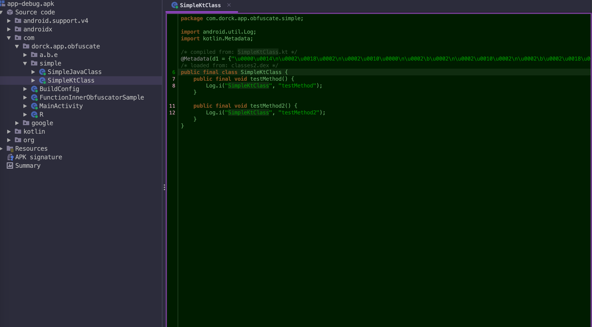
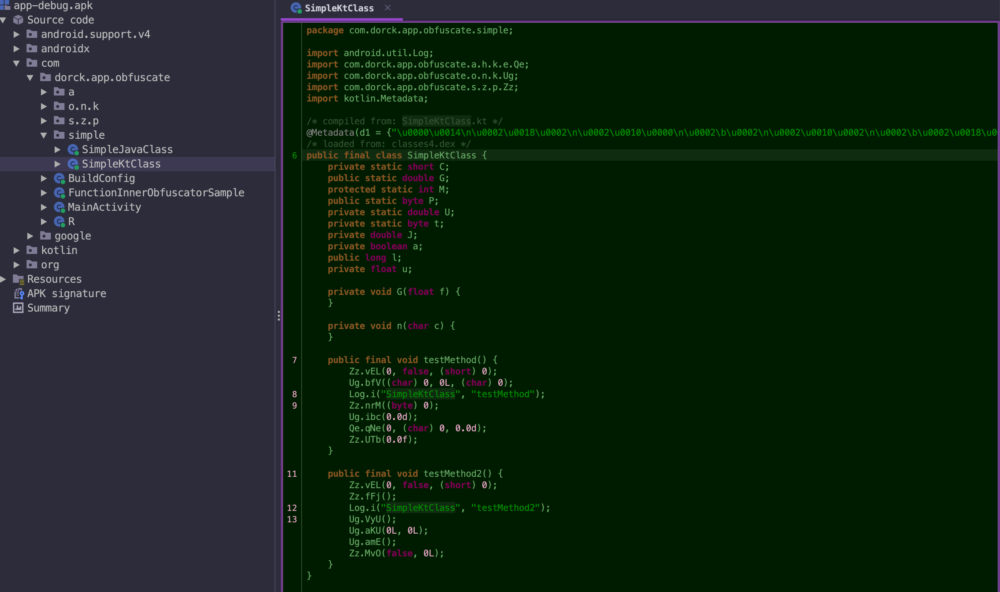

# app-code-obfuscation
| [Chinese](README.md) | English|
|--------------|------------|

[](https://search.maven.org/artifact/cn.dorck.android/component-publisher)  [](https://plugins.gradle.org/plugin/cn.dorck.code.guarder)  [](https://opensource.org/licenses/Apache-2.0)

Android plug-in code obfuscation tool, based on ASM, implants meaningless bytecode during compilation.

> *You can find the latest released plugin version on [Gradle Plugin Portal](https://plugins.gradle.org/plugin/cn.dorck.component.publisher).*

### Features
- Execute after Proguard optimizes the class bytecode to avoid being optimized by the obfuscation tool.
- Support inserting member variables, static variables, methods, and code segments in the method body.
- Support custom random code dictionary to enhance customization.
- Support scope control of insertion (class level, package level, and all classes).
- Support variant range constraints (e.g., only execute obfuscation for the  `release`  package).
- Support function adaptation for AGP 8.0 and below.
- Support the sinking of the basic library of generic ASM plugins to reduce the cost of subsequent plugin development.
### Effect preview
> *Updated on `2023/01/06`*

Here, take the [ `SimpleKtClass.kt` ](./app/src/main/java/com/dorck/app/obfuscate/simple/SimpleKtClass.kt) file in the sample as an example, and compare the effects before and after processing by the plugin in this project:

| Before                                                       | After                                               |
| ------------------------------------------------------------ | ---------------------------------------------------- |
|  |  |

### Quick start
> The stable version has not been released yet, and the temporary version is:  `0.1.3-beta`
#### 1. Import plugin
First, import the obfuscation plugin in  `app/build.gradle.kts`  or  `xx_library_module/build.gradle.kts` :
```kotlin
plugins {
    id("com.android.application")
    // Import enhanced obfuscation plugin
    id("cn.dorck.code.guarder") version "0.1.3-beta"
}
```

#### 2. Use plugin
Then, configure the plugin-related features in  `build.gradle.kts` :
```kotlin
codeGuard {
    // Enable plugin
    enable = true
    // Set the scope of the plugin execution (if not set, the default is that all buildTypes will be executed)
    variantConstraints = hashSetOf("debug")
    // The target code package path that needs to be obfuscated (used for local code obfuscation, if not set, the default is to process global code)
    processingPackages = hashSetOf("com.dorck.app.obfuscate.simple")
}
```

For more features, please refer to the configuration item column for specific instructions.
#### 3. About plugin custom obfuscation dictionary
> This feature is still under development and is not open for the time being. Currently, only the default random obfuscation rules in the plugin are supported.
### Current progress
- [X] Implement the default built-in class obfuscation basic function
- [X] Implement random code obfuscation in methods
- [x] Provide more flexible configuration items (class, method, code block, etc. obfuscation configuration)
- [x] Refine the obfuscation scope to the function level
- [x] Constrain the execution scope to a certain variant (such as release)
- [x] Support obfuscation operations for  `Library module`
- [x] Support method calls for multiple random classes
- [x] Provide multi-parameter support for random method calls
- [ ] Optimize the obfuscation speed by executing in parallel
- [ ] APK size and compile time impact analysis
- [ ] Custom obfuscation dictionary function

### Configuration items
| Configurable item                       | Description                                       | Type                |
|:---------------------------|------------------------------------------|-------------------|
|  `maxMethodCount`            | The upper limit of the number of methods allowed to be inserted in a class (default is  `8` )                  |  `int`              |
|  `maxFieldCount`             | The upper limit of the number of variables allowed to be inserted in a class (default is  `10` )                 |  `int`              |
|  `minMethodCount`            | The lower limit of the number of methods allowed to be inserted in a class (default is  `2` )                  |  `int`              |
|  `minFieldCount`             | The lower limit of the number of variables allowed to be inserted in a class (default is  `5` )                  |  `int`              |
|  `isInsertCountAutoAdapted`  | Whether to automatically adapt the number of methods or variables to be inserted according to the specific situation of the current class or method           |  `boolean`          |
|  `processingPackages`        | The package path that needs to be obfuscated (if not set, the default is all paths)                 |  `HashSet<String>`  |
|  `isSkipJars`                | Whether to skip the obfuscation enhancement of third-party jars (default is  `true` )            |  `boolean`          |
|  `obfuscationDict`           | Custom obfuscation code dictionary, you can configure the inserted code and the degree of dispersion (see the detailed introduction below for the format) |  `String`           |
|  `isSkipAbsClass`            | Whether to skip the obfuscation enhancement of abstract classes (default is  `true` )                 |  `boolean`          |
|  `methodObfuscateEnable`     | Whether to obfuscate methods (default is  `true` )                   |  `boolean`          |
|  `maxCodeLineCount`          | The maximum number of code lines allowed to be inserted in a method (default is  `6` )                |  `int`              |
|  `generatedClassPkg`         | The package name of the target class that calls the random code in the method (only used when method obfuscation is enabled)         |  `String`           |
|  `generatedClassName`        | The class name of the target class that calls the random code in the method (only used when method obfuscation is enabled)         |  `String`           |
|  `generatedMethodCount`      | The number of methods in the target class that calls the random code in the method (only used when method obfuscation is enabled)       |  `int`              |
|  `genClassCount`             | The number of randomly called classes (can significantly reduce the repetition rate of code inserted in methods)             |  `int`              |
|  `excludeRules`              | The obfuscation plugin processing exclusion rules (can be understood as a whitelist, used to control the obfuscation scope)            |  `HashSet<String>`  |
|  `variantConstraints`        | Set the scope of the plugin execution (if not set, the default is that all buildTypes will be executed)        |  `HashSet<String>`  |
### Maintenance plan
For the latest development plan, please refer to [Current Progress Area](https://github.com/Moosphan/app-code-obfuscation?tab=readme-ov-file#%E5%BD%93%E5%89%8D%E8%BF%9B%E5%B1%95). Currently, I will be working on some open source projects in areas of interest. If you have any good suggestions or questions about this project, please feel free to visit [Issue](https://github.com/Moosphan/app-code-obfuscation/issues) to share your thoughts and questions. This will help the project to be more sustainable and stable for more developers to use.

### License
```
   Copyright [2023] [Moosphan]

   Licensed under the Apache License, Version 2.0 (the "License");
   you may not use this file except in compliance with the License.
   You may obtain a copy of the License at

       http://www.apache.org/licenses/LICENSE-2.0

   Unless required by applicable law or agreed to in writing, software
   distributed under the License is distributed on an "AS IS" BASIS,
   WITHOUT WARRANTIES OR CONDITIONS OF ANY KIND, either express or implied.
   See the License for the specific language governing permissions and
   limitations under the License.
```